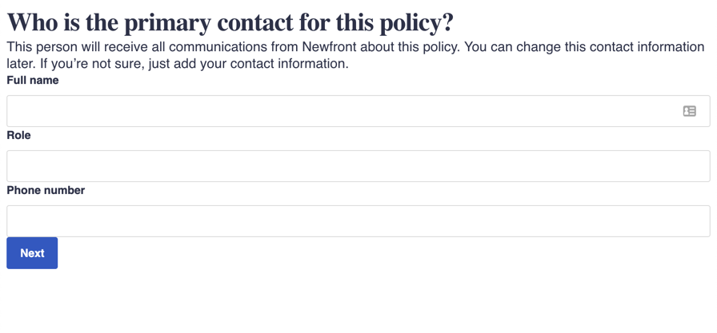

<div id="top"></div>

<!-- ABOUT THE PROJECT -->
## About The Project
"Insurance flow" an an application designed to build form flows that uses JSON responses to construct forms on the frontend.
It is a monorepo consisting of the following packages
* nf-client - A NextJS app that holds the API responses for the forms and renders the entrypoint into the flow.
* nf-ui - A component library that holds all of the UI components to be used, including `Workflow` which will be the entrypoint into every flow.
* nf-common - Although just currently for shared types, could also be leveraged for common test config, eslint configs, etc.. in the future.



### Built With

This section should list any major frameworks/libraries used to bootstrap your project. Leave any add-ons/plugins for the acknowledgements section. Here are a few examples.

* [Next.js](https://nextjs.org/)
* [React.js](https://reactjs.org/)
* [Lerna](https://github.com/lerna/lerna)


<!-- GETTING STARTED -->
## Getting Started

To run the app
```bash
git clone https://github.com/guyathomas/insurance-flow && cd insurance-flow;
yarn && yarn start
```


Navigate to [localhost:3000/workers-compensation](http://localhost:3000/workers-compensation)


## Key decisions
I wanted to follow a common convention for defining a schema, so that we could chose to replace with a standard lib in the future if we wanted ( like https://uniforms.tools/ ). I chose JTD for two reasons:
1. It gave the validation requirements that we needed in the spec
2. It gave us type safety over defining the schema from Typescript > Schema Definition.

I wanted to be able to switch up the schema and have the client understand both too. i.e. if we wanted to migrate to JSON schema, we could add another renderer, and schemaTransformer and then we'd be all good.


## Future improvements
In retrospect, JTD was not the right call. JSON schema would provide much better future extensibility on data validation ( i.e. a number range between 0-10 is not possible for JTD, but it in JSON schema )

I would also like a config to allow users to define different components to use based on the response. This would allow it to be more extensible without needing to really change the `Workflow` implementation. A thought is providing a custom component mapper into Workflow, that could override the default ones.


<!-- LICENSE -->
## License

Distributed under the MIT License. See `LICENSE.txt` for more information.

<p align="right">(<a href="#top">back to top</a>)</p>
